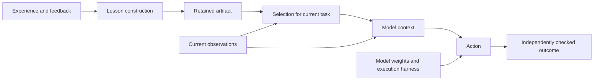

# Cycle 2: from a correction to a reusable lesson

2026-09-08 · Active root theory cycle. M2 evidence inspection and an initial
literature comparison are complete. The [derivative proposal](CYCLE_2_PROPOSAL.md)
now selects a small M2 reproduction and a controlled construction comparison;
its [development evidence has returned](CYCLE_2_PILOT.md), and a bounded
application diagnostic is ready for the next derivative agent. Cycle 1 continues separately under the user's
direction; Grok 4.6's findings will enter through a later evidence return.

## Starting question

**When does constructing a lesson from experience improve later decisions
beyond preserving the correction or providing a generic strategy?**

The [M2 review](CYCLE_2_M2_REVIEW.md) establishes the entry point: a supplied
correction influenced a later decision about the same finding. The
[literature review](CYCLE_2_LITERATURE.md) extends the inquiry to generated
principles, cross-task reuse, and reliability. This cycle develops an account
of what experience contributes, with a bounded derivative to test its predictions.

The initial framing—new capability versus eliciting an existing capability—is
useful but cannot be decided by a few failed baseline attempts. An unobserved
solution may still be possible under a different prompt or more sampling.
Likewise, using pretrained reasoning to apply a newly learned rule does not
make the system's improvement unreal. We need claims tied to specified
information, tasks, and resource budgets.

## Separate construction from application

Experience affects a later action through persistent changes. For external
text memory, a minimal account is:

The writer also brings pretrained knowledge and instructions to construction.
Any additional corrective labels, demonstrations, or expert input belong in
the information account. The diagram isolates external memory; weight updates
and persistent changes to tools would add other paths from experience to action.

With identical effective inputs, persistent state, and execution conditions,
a fresh model instance has the same conditional response distribution whether
a record was personally earned or copied. Individual sampled answers can still
differ. That is an information-flow boundary under the stated isolation
assumption, not a novel empirical law. Experience matters by changing what the
system acquires or how it acts on it.

This yields two different comparisons. To study **construction**, provide the
same source evidence to different ways of retaining or interpreting it. To
study **application**, hold the retained artifact fixed and change how it is
selected or consumed. Changing both at once can demonstrate system improvement
while leaving its explanation unresolved.

## Explanations to distinguish

These are alternative explanations of a particular gain, not mutually exclusive
definitions of learning. Their proposed signatures are hypotheses to test.

| Explanation | What experience contributes | Distinguishing pattern to seek |
| --- | --- | --- |
| Case-specific correction | A fact or decision about a particular case | Supplying the same correction is sufficient; the gain does not require a reusable procedure or the agent's earlier failure. |
| Elicitation and execution reliability | A cue, ordering rule, or reminder that makes available behavior more dependable | A strategy prepared without the relevant experience, or a matched increase in inference budget, accounts for much of the gain. Measure repeated performance, not only whether a task was ever solved. |
| Experience-dependent rule content | A relation between conditions, actions, and consequences that later decisions require | Correctly associated experience matters on fresh instances requiring that relation; generic advice is insufficient, and altering the relation in the experience alters the predicted decisions. |

The last pattern supports acquisition of useful rule content by the system.
It does not prove that the model acquired an entirely new internal algorithm.
Information about a relation and the ability to reason with it can have
different origins.

## Working conjecture: useful lessons preserve decision distinctions

**When tasks share action structure but differ in conditions that determine
success, a lesson retaining those conditions will transfer more selectively
than an unconditional summary or additional examples selected only for surface
similarity.** Compare representations constructed from the same available
evidence, accounting for their construction and use costs.

For example, a record about one retracted paper supplies an instance-specific
correction. A procedure for checking the current status of a source could help
with another paper whose status is absent from memory. A blanket instruction
to decline citations could look successful on retracted papers while failing
valid ones. These are different changes to decision-making.

The conjecture predicts that abstraction can help by removing distracting
particulars, and harm by removing a necessary condition or exception. Its rival
is that generic strategy cues or better access to the raw evidence account for
the apparent benefit. Another rival is that the consumer already reconstructs
the relevant distinction from current observations, making explicit lessons
redundant.

Conditional guidelines and abstractions are established ideas in the reviewed
work. The contribution to pursue is an explanation of when their retained
content earns its benefit and when simpler representations suffice. We have
not established a novel mechanism or a general result.

## Evidence that would move the account

The first useful comparison would distinguish a learned lesson from both its
underlying correction and a competent strategy prepared without that specific
experience. Retaining raw evidence is also a substantive alternative: a learned
summary may add value through lower cost or clearer presentation without adding
new information. Match access to source evidence when testing representation;
disclose information differences when testing acquisition.

Fresh evaluation should separate repeated cases, new cases with the same
relevant relation, and cases where that relation no longer licenses the old
action. Changing names alone is insufficient. New-task success can still come
from reusing a fact, so task identity cannot classify the learned object for us.

Repeated success and success at least once answer different operational
questions. Neither reveals an absolute capability ceiling. Compare behavior
under declared budgets, preserve individual failures, and treat an acquired
history as a unit of variation when multiple tasks share it.

Interpret the returns separately:

- A correct supplied lesson works but the generated one fails: investigate
  construction and its evidence before drawing a ceiling on memory use.
- Raw evidence or generic advice matches the generated lesson at lower total
  cost: reduce the claimed value of that construction method.
- Relevant rule content improves new decisions selectively and survives
  correction: strengthen the case for a reusable, revisable system change.
- More dependable performance appears without evidence of a new rule:
  record a reliability gain on the tested tasks.
- Output or scoring failures prevent the comparison: record the instrument
  limitation without converting it into evidence against the learning claim.

## Root work next

The closer comparison of CLIN, ERL, and S3Gym informed the
[Cycle 2 proposal](CYCLE_2_PROPOSAL.md). Its [pilot return](CYCLE_2_PILOT.md)
now separates visible construction errors from failures to apply correct
guidance on composed tasks. The incoming agent owns the next diagnostic.
At the root, compare these boundaries with Cycle 1's eventual evidence return:
does useful memory fail because the relevant information was not acquired,
not retained, not selected, or not applied? Keep broader comparisons of
persistence mechanisms open rather than inferring them from this single
text-memory experiment.

The earlier EFC line also asked about a learned checking behavior across domains.
Its [recorded instrument and admission failures](RESEARCH_BRIEF.md) remain
relevant limits on that attempt; they do not settle the present conjecture.
They are context for theory formation, rather than an inherited repair queue.
